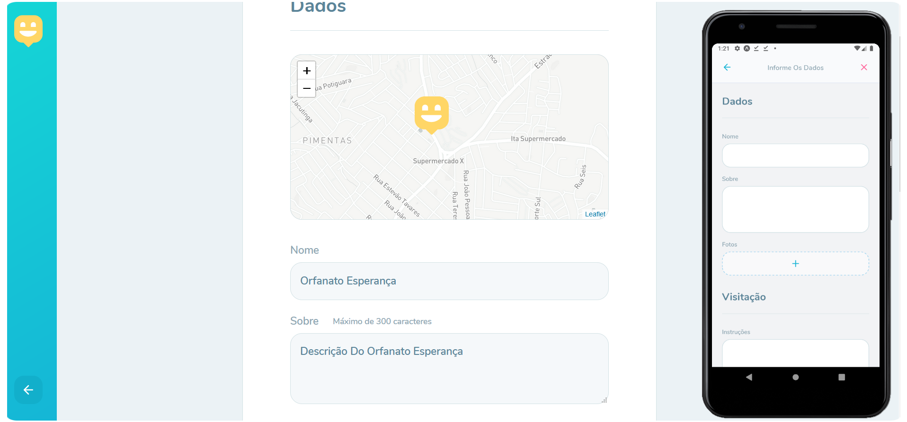
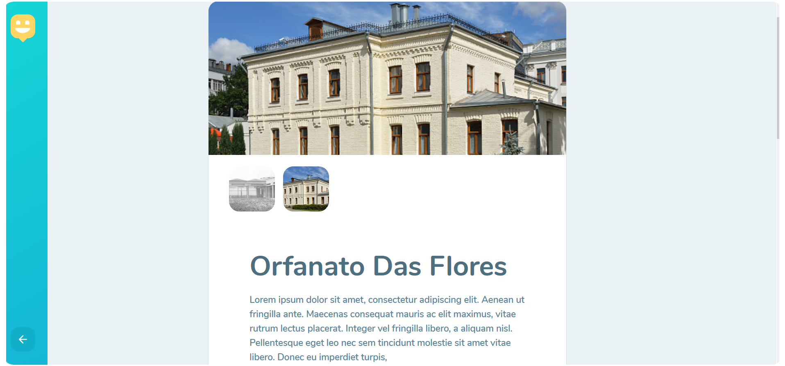

<p align="center">
  
</p>

# Happy
  

<p align="center">
  
</p>

## Tecnologias
- [x] NodeJS
- [x] Express
- [x] Typeorm
- [x] React
- [x] Axios
- [x] Leaflet
- [x] Expo
- [x] React Native
- [x] React Native Maps

## Sobre o Projeto
O happy é uma plataforma que tem o objetivo de conectar pessoas aos orfanatos da sua região.

<p align="center">
  
</p>

<p align="center">
  
</p>

<p align="center">
  
</p>

## Instalação
### Back-end 
```
cd happy-server
npm install
npm run typeorm migration:run
npm run dev
```

###Fron-end (Web)
```
cd happy-web
npm install
npm run start
```

###Fron-end (Mobile) `Requer o Expo instalado`
```
cd happy-mobile
npm install
npm run start
```
